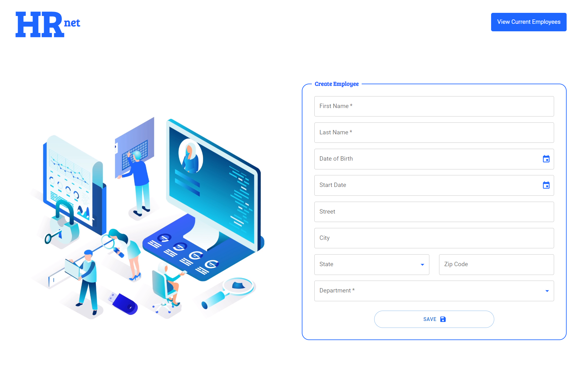
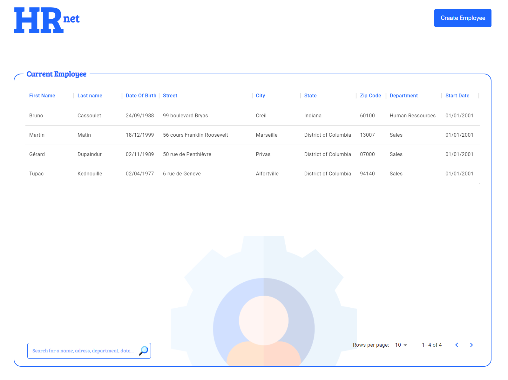
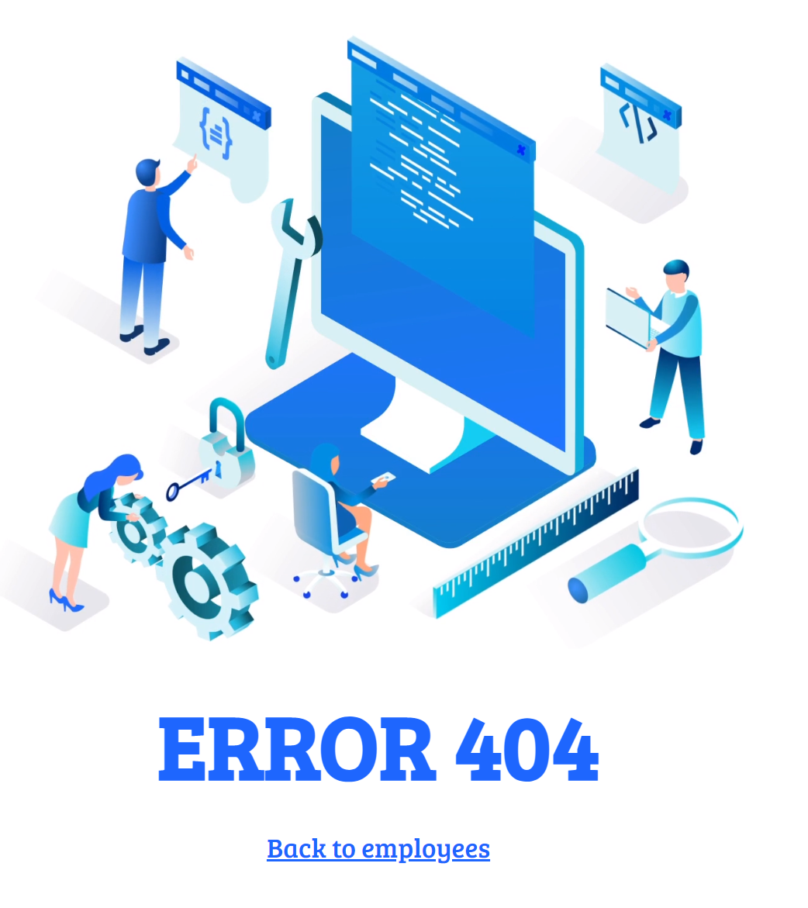

# 🧑‍💻 HRnet

HRnet is a project where the main goal is to convert an entire aging JQuery application into a robust, higher performance React application with a more modern design.
This application allows you to add, via a form, employees to a data table, the data is persistent within the application thanks to a state manager

# Prerequisites

- [NodeJS](https://nodejs.org/en/)
- [npm](https://www.npmjs.com/)

## Technologies

This project is developed with:

- [React 18.1.0](https://fr.reactjs.org/)
- [React Router 6.3.0](https://reactrouter.com/)
- [React Redux 8.0.2](https://reactrouter.com/)
- [Redux Toolkit 1.8.3](https://redux-toolkit.js.org/)
- [Proptypes 15.8.1](https://www.npmjs.com/package/prop-types)
- [Material UI 5.10.0](https://mui.com/material-ui/)
- [moment.js 2.29.4](https://momentjs.com/)
- [leolegrandm-simple-dialog 0.2.1](https://github.com/leolegrand/leolegrandm-simple-dialog)

## Installation

Clone the repository

```sh
git clone https:https://github.com/leolegrand/LeoLegrand_14_01082022
```

Install the dependencies/npm packages

```sh
npm install
```

Run the project

```sh
npm start
```

> By default the server is hosted on http://localhost:3000

## 🔗 Original app

https://github.com/OpenClassrooms-Student-Center/P12_Front-end

> Follow this link to find the original repo of the application, before its rework
